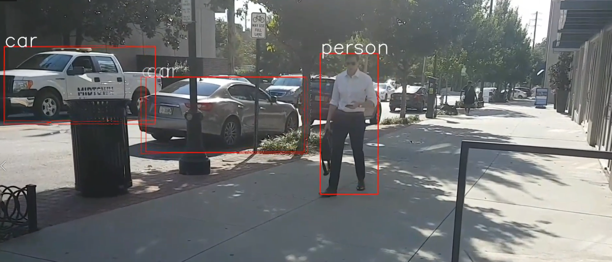

# SSD Object Recognition #
The program is implemented in Python 3 using a pretrained SSD model and openCV2 library. 
The main reason why we will use a pretrained SSD model is that training an SSD require several hours or days and particular computer resources, for this reason usually pretrained SSD are used.

More informations about the dataset on which the SSD has been pretrained can be found on this link:
http://host.robots.ox.ac.uk/pascal/VOC/

The following files are present:
* 'ssd.py' that contains the SSD model
* 'Object-Detection.py' that is the file in which the detection is done
* 'homework3.mp4' contains a video recorded by me, in which several objects are present
* 'output3.mp4' contains the output of the program, that consists in the video with the detection of the objects
* 'output3_slow_2.mp4' contains the same video but with a slow motion effect

In the folder 'Other videos' you can find other videos on which I tested the SSD.
To run the program, you need to have Torch, imageio and OpenCV2 installed.

Besides, to run the program you need to download the pretrained weights from the following link:

https://drive.google.com/open?id=1zfGjsatAVsrBIMDTceIh95UO8sfs4kDD

Run the 'Object-Detection.py' file to start the detection in the video. You can apply this program to other videos just by changing the input video with another one.

 

