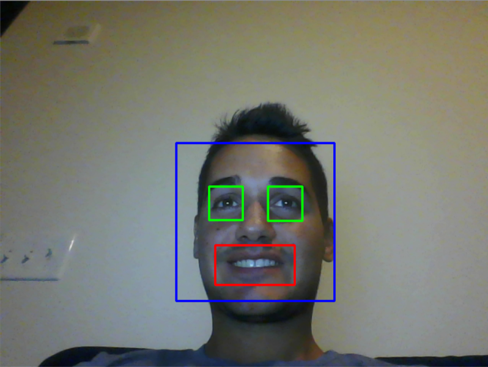

# Smile Detector #
The program is implemented in Python 3 using openCV2 library and it can recognize face,eyes and smile in real time from the webcam.
It uses 3 haar cascades for face,eyes and smile detection:

*'haarcascade_frontalface_default.xml'
*'haarcascade_eye.xml'
*'haarcascade_smile.xml'

To run the program you just need to have OpenCV2 installed and Python 3.
To close the webcam press 'q' and in case the webcam doesn't open try to change in line 39 the parameter of videoCapture(0) to 1 because it can depends on the webcam settings.

 
